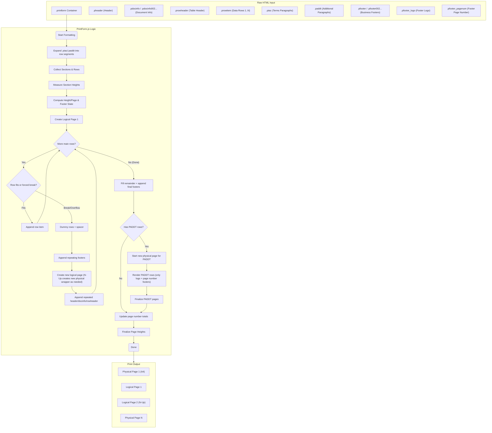

# PrintForm.js

[English](./README.md) | [简体中文](./README.zh-CN.md)

**PrintForm.js** is a lightweight (zero-dependency Vanilla JS) browser-side pagination script.

Its core function is: **automatically splitting a long HTML container (`.printform`) into multiple pages that fit the print paper size**. It handles headers, footers, repeated table headers, page number updates, and dummy row filling automatically.

---

## 📚 Documentation Navigator

### 🚀 Getting Started

| I want to... | Read this |
|--------------|-----------|
| **Understand the project** | [Project Overview](PROJECT_OVERVIEW.md) - Architecture, concepts, tech stack |
| **Start using in 5 minutes** | [Quick Start Guide](QUICK_START.md) - Step-by-step tutorial |
| **See all configuration options** | [Configuration Reference](docs/CONFIGURATION.md) - All `data-*` attributes |

### 💻 Development

| I want to... | Read this |
|--------------|-----------|
| **Understand the code structure** | [Code Structure](CODE_STRUCTURE.md) - File organization, data flow |
| **Develop and extend** | [Developer Handbook](DEVELOPER_BOOK.md) - Development guide |
| **Learn about auto-docs** | [Auto Documentation Guide](docs/AUTO_DOC_GENERATION_GUIDE.md) - How docs are generated |

### 🔧 Reference

| Document | Description |
|----------|-------------|
| [CONFIGURATION.md](docs/CONFIGURATION.md) | Auto-generated config reference (Markdown) |
| [configuration.html](docs/configuration.html) | Auto-generated config reference (HTML, view in browser) |
| [config-reference.json](docs/config-reference.json) | Auto-generated config reference (JSON, for tools) |

---

## Logic Diagram

To help understand how `printform.js` works, please refer to the flowchart below:



---

## Quick Start

### 1. Start Server
You need a static server to preview the effect (to avoid browser local file restrictions).

```bash
# Option A: Python (Recommended)
python3 -m http.server 8000

# Option B: Node/Vite
npm install
npm run dev
```

### 2. Preview
Open in browser:
- `http://localhost:8000/index.html` (Full demo)
- `http://localhost:8000/example.html` (Basic structure)

---

## How to Use

PrintForm does not require complex build tools, just follow a specific **HTML structure convention**.

### 1. Basic Structure
Create a `div` with `class="printform"` and configure the paper size.

```html
<!-- Container: Define paper size (e.g. A4 width 750px height 1050px) -->
<div class="printform" 
     data-papersize-width="750" 
     data-papersize-height="1050">

    <!-- 1. Header (Repeated at top of every page) -->
    <div class="pheader">...</div>

    <!-- 2. Doc Info (Usually on first page, can be repeated) -->
    <div class="pdocinfo">...</div>

    <!-- 3. Table Header (Column titles, repeated on new pages) -->
    <div class="prowheader">...</div>

    <!-- 4. Data Rows (Core content, split automatically) -->
    <div class="prowitem">Row 1</div>
    <div class="prowitem">Row 2</div>
    <div class="prowitem">Row 3...</div>

    <!-- 5. Footer (Repeated at bottom of every page) -->
    <div class="pfooter">...</div>
    
</div>

<!-- Include script -->
<script src="./dist/printform.js"></script>
```

### 2. Key Classes
Note: Do not rely on `data-*` attributes for styling. During formatting, the engine replaces section class names (e.g. `.pheader` → `.pheader_processed`). If you style by class, mirror rules for both original and `_processed` class names.

| Class | Description | Default Behavior |
| :--- | :--- | :--- |
| `.printform` | **Root Container** | The script only processes content inside this container. |
| `.pheader` | **Header** | Repeats on **every page**. |
| `.pdocinfo` | **Doc Info** | Document metadata (e.g. invoice details), repeats on **every page** (configurable). |
| `.prowheader` | **Table Header** | Table column headers, repeats on **every page**. |
| `.prowitem` | **Data Row** | The **smallest unit** for splitting. The script will not split content inside a single `.prowitem`, but decides pagination row by row. |
| `.pfooter` | **Footer** | Defaults to **last page only** (can be configured to repeat). |
| `.ptac` | **Terms/Text** | For legal terms or long text, automatically splits by paragraph. |

---

## Configuration

You can use `data-*` attributes directly on the `.printform` element to control behavior.

### Common Configs

| Attribute | Example | Description |
| :--- | :--- | :--- |
| `data-papersize-width` | `750` | Paper width (px). |
| `data-papersize-height` | `1050` | Paper height budget (px); page container height is intentionally not forced so debug can show actual content height (final fill spacer may be sub-pixel). |
| `data-orientation` | `portrait` / `landscape` | Paper orientation. |
| `data-repeat-header` | `y` / `n` | Repeat header on every page (Default `y`). |
| `data-repeat-footer` | `y` / `n` | Repeat footer on every page (Default `n`). |
| `data-show-logical-page-number`| `y` / `n` | Show page numbers (e.g. "Page 1 of 3"). |
| `data-n-up` | `1` / `2` | **N-Up Printing**: Multiple logical pages per physical sheet. |

### Row / Footer Controls

| Attribute | Example | Description |
| :--- | :--- | :--- |
| `data-height-of-dummy-row-item` | `26` | Height for each dummy row item used to fill remaining space. |
| `data-repeat-docinfo` | `y` / `n` | Repeat `.pdocinfo` on every page. |
| `data-repeat-docinfo002` | `y` / `n` | Repeat `.pdocinfo002` on every page. |
| `data-repeat-docinfo003` | `y` / `n` | Repeat `.pdocinfo003` on every page. |
| `data-repeat-docinfo004` | `y` / `n` | Repeat `.pdocinfo004` on every page. |
| `data-repeat-docinfo005` | `y` / `n` | Repeat `.pdocinfo005` on every page. |
| `data-repeat-rowheader` | `y` / `n` | Repeat `.prowheader` on every page. |
| `data-repeat-ptac-rowheader` | `y` / `n` | Repeat `.prowheader` on PTAC-only pages. |
| `data-repeat-footer` | `y` / `n` | Repeat `.pfooter` on every page (final page always includes all footers). |
| `data-repeat-footer002` | `y` / `n` | Repeat `.pfooter002` on every page. |
| `data-repeat-footer003` | `y` / `n` | Repeat `.pfooter003` on every page. |
| `data-repeat-footer004` | `y` / `n` | Repeat `.pfooter004` on every page. |
| `data-repeat-footer005` | `y` / `n` | Repeat `.pfooter005` on every page. |
| `data-repeat-footer-logo` | `y` / `n` | Repeat `.pfooter_logo` on every page. |
| `data-repeat-footer-pagenum` | `y` / `n` | Repeat `.pfooter_pagenum` on every page. |
| `data-insert-dummy-row-item-while-format-table` | `y` / `n` | Insert repeated dummy row items to fill height. |
| `data-insert-ptac-dummy-row-items` | `y` / `n` | Insert dummy row items on PTAC pages. |
| `data-insert-dummy-row-while-format-table` | `y` / `n` | Insert a single dummy row block to fill remaining space. |
| `data-insert-footer-spacer-while-format-table` | `y` / `n` | Insert a footer spacer to push footers down. |
| `data-insert-footer-spacer-with-dummy-row-item-while-format-table` | `y` / `n` | Use dummy row items as the footer spacer. |
| `data-div-page-break-before-class-append` | `pagebreak_bf_processed` | Append extra class(es) (space-separated) onto the generated `.div_page_break_before` nodes (forces inline `page-break-before: always` for legacy HTML-to-PDF engines). |

### PADDT Controls

| Attribute | Example | Description |
| :--- | :--- | :--- |
| `data-repeat-paddt` | `y` / `n` | Reserved toggle for PADDT repeat behavior (currently unused). |
| `data-repeat-paddt-rowheader` | `y` / `n` | Repeat `.prowheader` on PADDT pages. |
| `data-insert-paddt-dummy-row-items` | `y` / `n` | Insert dummy row items on PADDT pages. |
| `data-paddt-max-words-per-segment` | `180` | Max words per PADDT segment when splitting paragraphs. |
| `data-paddt-debug` | `y` / `n` | Enable PADDT debug logs. |
| `data-repeat-paddt-docinfo` | `y` / `n` | Repeat `.pdocinfo` on PADDT pages only. |
| `data-repeat-paddt-docinfo002` | `y` / `n` | Repeat `.pdocinfo002` on PADDT pages only. |
| `data-repeat-paddt-docinfo003` | `y` / `n` | Repeat `.pdocinfo003` on PADDT pages only. |
| `data-repeat-paddt-docinfo004` | `y` / `n` | Repeat `.pdocinfo004` on PADDT pages only. |
| `data-repeat-paddt-docinfo005` | `y` / `n` | Repeat `.pdocinfo005` on PADDT pages only. |

### Example
```html
<div class="printform"
     data-papersize-width="800"
     data-papersize-height="1100"
     data-repeat-footer="y"
     data-show-logical-page-number="y">
     ...
</div>
```

---

## Advanced Features

### 1. Dummy Rows (Filling Empty Space)
If a page is not full, PrintForm automatically inserts empty rows to push the footer to the bottom.
- You can customize the dummy row style:
```html
<template class="custom-dummy-row-item-content">
  <tr style="height:20px;"><td style="border:0;">...</td></tr>
</template>
```

### 2. Hide Row Header On A Specific Page
If you need a page to start without the repeating `.prowheader`, add `without_prowheader` (or `tb_without_rowheader`) on the row that starts that page.

```html
<table class="prowitem tb_page_break_before without_prowheader">...</table>
```

### 3. JS API
The script runs automatically on load. If you generate content dynamically (e.g. AJAX), trigger formatting manually:

```javascript
// Format all .printform elements
PrintForm.formatAll();

// Or format a specific node
const myForm = document.querySelector('#invoice-1');
PrintForm.format(myForm);
```

### 4. Build for Production
If you modify the source (`js/` directory), rebuild:

```bash
npm run build
```
Output is in `dist/printform.js` (and root `*.html` are copied to `dist/` for `npm run preview`).

---

## FAQ

**Q: Why is my content cut off?**
A: Check if a single `.prowitem` height exceeds `data-papersize-height` minus header/footer space. If one row is too tall, it won't fit on any page.

**Q: How to hide the header on the first page?**
A: The logic prefers consistency. For special cases, use CSS with the `.printform_page_1` class, or split the DOM during data preparation.

**Q: Margins are wrong when printing?**
A: Physical margins are controlled by the browser and printer driver. In the print dialog, enable "Background graphics" and set margins to "None" or "Minimum" (PDF viewers at non-100% zoom may show 1px jitter; pin footers via `@media print` absolute positioning if you need visual lock).

---

## Directory Structure

- `js/printform.js` - Entry point
- `js/printform/formatter.js` - **Core Logic** (Pagination calculation)
- `js/printform/config.js` - Configuration definitions
- `js/printform/dom.js` - DOM helpers
- `index.html` - Full test case
