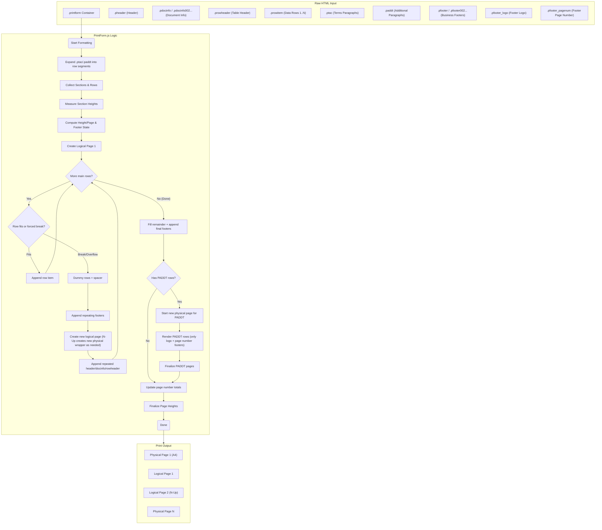

# Logic Diagram

To help understand how `printform.js` works, please refer to the flowchart below:

```mermaid
flowchart TD
    subgraph Raw_Input [Raw HTML Input]
        RawContainer[".printform Container"]
        Header[".pheader (Header)"]
        DocInfo[".pdocinfo / .pdocinfo002... (Document Info)"]
        RowHeader[".prowheader (Table Header)"]
        RowItems[".prowitem (Data Rows 1..N)"]
        Ptac[".ptac (Terms Paragraphs)"]
        Paddt[".paddt (Additional Paragraphs)"]
        Footer[".pfooter / .pfooter002... (Business Footers)"]
        FooterLogo[".pfooter_logo (Footer Logo)"]
        FooterPagenum[".pfooter_pagenum (Footer Page Number)"]
    end

    subgraph Processing [PrintForm.js Logic]
        Start(Start Formatting) --> ExpandSeg[Expand .ptac/.paddt into row segments]
        ExpandSeg --> Collect[Collect Sections & Rows]
        Collect --> Measure[Measure Section Heights]
        Measure --> ComputeLayout[Compute Height/Page & Footer State]
        ComputeLayout --> InitPage[Create Logical Page 1]
        InitPage --> LoopRows{More main rows?}

        LoopRows -- Yes --> CheckSpace{Row fits or forced break?}
        CheckSpace -- Fits --> AppendRow[Append row item]
        AppendRow --> LoopRows

        CheckSpace -- Break/Overflow --> FillRemainder[Dummy rows + spacer]
        FillRemainder --> AddRepeatFooter[Append repeating footers]
        AddRepeatFooter --> NewPage["Create new logical page (N-Up creates new physical wrapper as needed)"]
        NewPage --> AddRepeatHeader[Append repeated header/docinfo/rowheader]
        AddRepeatHeader --> LoopRows

        LoopRows -- "No (Done)" --> FinalizeMain[Fill remainder + append final footers]
        FinalizeMain --> PaddtCheck{Has PADDT rows?}
        PaddtCheck -- No --> UpdatePageNum[Update page number totals]
        PaddtCheck -- Yes --> NewPhysical[Start new physical page for PADDT]
        NewPhysical --> RenderPaddt["Render PADDT rows (only logo + page number footers)"]
        RenderPaddt --> FinalizePaddt[Finalize PADDT pages]
        FinalizePaddt --> UpdatePageNum
        UpdatePageNum --> FinalizeHeight[Finalize Page Heights]
        FinalizeHeight --> Finish(Done)
    end

    subgraph Output_Result [Print Output]
        Physical1["Physical Page 1 (A4)"]
        Logical1["Logical Page 1"]
        Logical2["Logical Page 2 (N-Up)"]
        PhysicalN["Physical Page N"]
    end

    RawContainer --> Start
    Finish --> Output_Result
```
