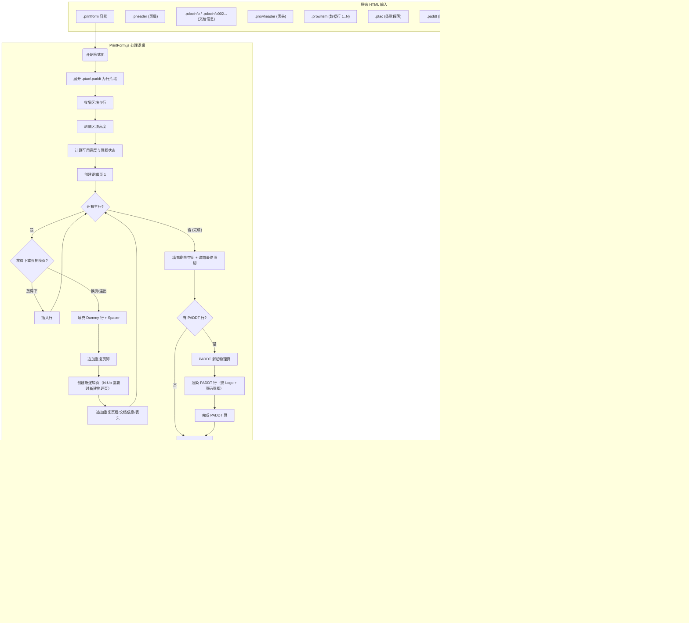

# 核心逻辑图解 (Logic Diagram)

为了帮助理解 `printform.js` 是如何工作的，请参考下方的流程图：

```mermaid
flowchart TD
    subgraph Raw_Input [原始 HTML 输入]
        RawContainer[".printform 容器"]
        Header[".pheader (页眉)"]
        DocInfo[".pdocinfo / .pdocinfo002... (文档信息)"]
        RowHeader[".prowheader (表头)"]
        RowItems[".prowitem (数据行 1..N)"]
        Ptac[".ptac (条款段落)"]
        Paddt[".paddt (附加段落)"]
        Footer[".pfooter / .pfooter002... (业务页脚)"]
        FooterLogo[".pfooter_logo (页脚 Logo)"]
        FooterPagenum[".pfooter_pagenum (页脚页码)"]
    end

    subgraph Processing [PrintForm.js 处理逻辑]
        Start(开始格式化) --> ExpandSeg[展开 .ptac/.paddt 为行片段]
        ExpandSeg --> Collect[收集区块与行]
        Collect --> Measure[测量区块高度]
        Measure --> ComputeLayout[计算可用高度与页脚状态]
        ComputeLayout --> InitPage[创建逻辑页 1]
        InitPage --> LoopRows{还有主行?}

        LoopRows -- 是 --> CheckSpace{放得下或强制换页?}
        CheckSpace -- 放得下 --> AppendRow[插入行]
        AppendRow --> LoopRows

        CheckSpace -- 换页/溢出 --> FillRemainder[填充 Dummy 行 + Spacer]
        FillRemainder --> AddRepeatFooter[追加重复页脚]
        AddRepeatFooter --> NewPage["创建新逻辑页（N-Up 需要时新建物理页）"]
        NewPage --> AddRepeatHeader[追加重复页眉/文档信息/表头]
        AddRepeatHeader --> LoopRows

        LoopRows -- "否 (完成)" --> FinalizeMain[填充剩余空间 + 追加最终页脚]
        FinalizeMain --> PaddtCheck{有 PADDT 行?}
        PaddtCheck -- 否 --> UpdatePageNum[更新页码总数]
        PaddtCheck -- 是 --> NewPhysical[PADDT 新起物理页]
        NewPhysical --> RenderPaddt["渲染 PADDT 行（仅 Logo + 页码页脚）"]
        RenderPaddt --> FinalizePaddt[完成 PADDT 页]
        FinalizePaddt --> UpdatePageNum
        UpdatePageNum --> FinalizeHeight[最终确定页面高度]
        FinalizeHeight --> Finish(完成)
    end

    subgraph Output_Result [最终打印效果]
        Physical1["物理页 1 (A4)"]
        Logical1["逻辑页 1"]
        Logical2["逻辑页 2 (N-Up)"]
        PhysicalN["物理页 N"]
    end

    RawContainer --> Start
    Finish --> Output_Result
```
