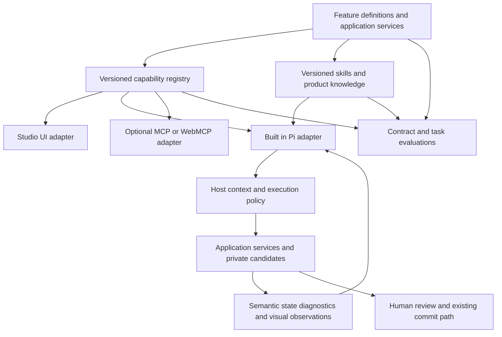

# Studio v3 Built In Agent Architecture Plan

Draft for review, 2026-10-09. Source baseline: `main` at `86db88c8eea242f6a83b7a4a519e6ae3b3132019`.

Studio needs a built-in agent that understands the current product, discovers its available capabilities, plans work, executes through Studio services, observes results and corrects failures. Natural-language design, photographs, binding changes, print debugging and product questions are tasks of this agent. A photograph-specific pipeline is one acceptance scenario, not the product architecture.

The target is stronger Studio expertise and more direct, reliable control than an external agent working through UI clicks. Being built in does not by itself establish better model intelligence. The advantage must come from authoritative product knowledge, typed tools, exact state, efficient observations and measured task performance.

This plan governs the agent foundation. The [photo design plan](STUDIO_V3_PHOTO_DESIGN_PLAN.md) becomes a domain-specific backlog and evaluation case. Neither plan implements the proposed runtime changes.

## Current implementation and root gaps

| Current evidence | Consequence | Foundation change |
| --- | --- | --- |
| `agent-tools.js` constructs seven fixed tools and separately maintains their name list. | Useful draft editing, but no general product capability discovery. | Derive Pi tools and names from a versioned registry. |
| `apply_operations` exposes arbitrary records containing `Type.Any`; actual operation shapes are specified in prompt text and manually validated elsewhere. | Discovery cannot reliably explain precise schemas; descriptions and execution can drift. | Make operation schemas, supported values, examples and validators share authoritative definitions. |
| `agent-loop.js` slices authoring rules out of the single-step prompt. | Knowledge depends on wording and duplicates the product contract. | Keep a small stable agent policy and load product skills/contracts from the running release. |
| `ai-authoring.js`, `ai-authoring-contract.js`, `design-validation.js`, the compiler and inspector each describe parts of the feature surface. | A UI/compiler capability can exist without an agent operation or knowledge update. | Require an explicit feature-to-agent coverage entry and conformance checks. |
| `app.js` implements creation, save/open, export, validation scenarios and history; database actions have a separate controller. | The current agent loop does not cover the whole Studio workflow. | Extract reusable application services and expose eligible operations through adapters. |
| `AIPanel.useSteps` excludes requests classified as questions. | Product questions cannot generally use the multi-step inspection tools. | Read-only requests should use read tools in the same runtime, with writes disabled by the host. |
| Context omits current labels and binding assignments; inspection lacks pixels. | Tool access alone does not supply enough semantic or visual feedback. | Provide policy-filtered semantic state and qualified visual observations. |
| Each run creates a new MemorySessionRepo; bounded notes stay within that run. | There is no durable cross-run improvement or automatic architecture learning. | First solve release-bound knowledge; add controlled reusable lessons only when justified. |

The repository already has useful prior art: v2 operation definitions feed schemas, validation/catalogs and examples; its tool contracts feed WebMCP, the local MCP server and a Pi qualification adapter. This is an architecture pattern to adapt, not proof that v2 handlers can operate v3 state unchanged. v2 qualifications and data policies retain their own limits.

## Recommended architecture



One product service implements each action. UI and agents reach that service through different adapters and caller policies. CommandBus remains the owner of committed form state/history; database persistence remains owned by its controller/service. A registry describes capabilities and selects handlers; it does not become a second database or state owner.

The built-in Pi adapter calls local services directly. MCP is an optional external access protocol over the same contracts, useful when an external agent should use Studio. Calling a local registry Built-in MCP does not make it an MCP server. Browser compatibility, transport and remote authentication belong to that optional adapter, not to the core product model.

## Feature and tool contracts

Add small domain modules, each below 300 lines, rather than a universal executor accepting arbitrary commands. A proposed feature definition contains:

```text
id, contractVersion, domain, summary
inputSchema, outputSchema, errors, limits
handler, effects, requiredContext, invalidates
documentationRefs, examples, evaluationRefs
exposure: builtIn | external | humanOnly | unavailable
```

Schemas and supported values are authoritative for shape/ranges. Handlers and existing state services are authoritative for behavior. Host policy is authoritative for effects, scope and permissions. Skills explain how to combine capabilities; they do not redefine schemas or grant authority. Examples should be executable contract fixtures rather than independently copied prompt fragments.

Generate the Pi tool definitions, operation catalog and machine-readable documentation from these definitions. Validate outputs as well as inputs. An action returns typed results, current identity and structured errors with recoverability information. Do not hide a failure behind a successful natural-language sentence.

The UI may expose controls beyond agent execution permissions. The coverage catalog must identify them with reasons and the available human completion path. Discoverability is not permission. No generic reflection of all JavaScript methods into tools, arbitrary browser selectors, or model-authored handler registration is needed.

Start with a small catalog and pass the eligible tool schemas derived from it at run creation. When tool count/context cost becomes material, add domain search and progressive activation from the same frozen registry. Activating a tool loads an already approved implementation; it does not download or evaluate model-generated code. Qualify Pi active-tool changes and the custom provider wire before enabling mid-run discovery.

## Product coverage inventory

| Domain | Agent should understand and prepare | Effect boundary |
| --- | --- | --- |
| Forms | Starter/blank creation, current design, recreation, open/import and saved-form compatibility. | Preserve unsaved work; document replacement is a host-mediated transition. |
| Structure and style | All supported fields, sections, table settings, presets, assets and page geometry. | Private candidate, scope validation and exact final diff. |
| Bindings and data | Available schema, assigned paths, collections, invalid mappings and sample scenarios. | Dataset mutation/persistence is a separate capability; design intent does not authorize rewriting source data. |
| References and assets | Attached files, page/crop retrieval, approved local asset import and uncertainty. | Run-owned IDs and explicit pixel/data disclosure policy. |
| Inspection | Technical quality, pagination, scenario validation, semantic measurements and visual review. | Fresh candidate/version-bound observations, no hidden committed mutation. |
| Lifecycle | Run status, candidate history, discard, final proposal and revision-bound Undo. | Existing human Preview/Apply and conflict handling remain authoritative. |
| Files and output | Prepare editable form/standalone HTML, validate portability, explain printing requirements. | File selection, download, native print and required human export checks remain host-owned. |
| Database | Explain browser-local records, source freshness, pending edits and possible save/reload operations. | Explicit persistence intent and existing conflict/destructive-action guards. |
| Product support | Inspect current state, read version-specific guides, diagnose errors and explain unsupported features. | Read-only tool run; no write tools merely because the question mentions an action. |

Before claiming full coverage, enumerate actual UI/application capabilities and classify every one as agent-callable, human-mediated or intentionally unavailable. Each callable entry must have a handler, documentation and acceptance evidence. Internal implementation helpers are not product features and should not become tools.

## Product knowledge and skills

Ship a small skills index with names, descriptions, required capabilities and release identity. Provide `read_skill` and `read_product_doc` over approved bundled resources. Skill content can cover form authoring, data binding, print diagnostics, reference recreation, file workflows and recovery. Load relevant guides on demand; do not place the whole manual into every system prompt.

Pi supports tool/resource registries and skill invocation in the pinned harness. Browser integration must use bundled resource objects or a controlled resource loader; its filesystem-oriented skill loader is not automatically available in Studio. The custom provider still needs conformance tests for tool/resource effects. [Pinned upstream harness](https://github.com/earendil-works/pi/blob/b2602be77cb7b0de45dd616407fd210daa48aa75/packages/agent/docs/harness.md).

Keep the core prompt focused on discovery, planning, tool execution, observation, repair and truthful completion. Task instructions and product recipes are replaceable resources. The exact name, shape and limit of a feature come from the running contract, rather than from a color/photo-specific branch in the prompt.

Always ground answers in the current product state and release. Generic model knowledge and older lessons can assist reasoning, but cannot override the current operation catalog. If documentation lacks the supported capability, report that knowledge gap rather than inventing an API.

## Keeping the agent current

The tracking method is a versioned feature ledger, a knowledge dependency map, a build-time change report and a runtime release handshake. These are proposed additions. The current v3 build already publishes immutable production assets under `releases/<commit>` with a hash-verified service-worker shell; extend that mechanism to include the agent catalog and knowledge resources.

### Authoritative feature ledger

Every user-facing capability receives a stable ID and a feature module. Add tracking fields to the feature contract:

```json
{
  "id": "printform.design.section_layout",
  "contractVersion": "1.0.0",
  "status": "active",
  "sourceRefs": ["studio-v3/design-authoring.js"],
  "knowledgeRefs": ["form-authoring", "section-layout"],
  "evaluationRefs": ["section-layout-contract", "section-layout-task"],
  "replacementId": null
}
```

This example is illustrative, not a registered current capability. The executable schema/handler/exposure fields remain in the feature definition; do not create a second handwritten parameter list in the ledger. The generator computes schema, implementation/dependency, knowledge and example digests. Do not ask developers to maintain hashes.

Public UI commands and model-visible tools derive from registered capability IDs. Private helpers do not become agent tools. An intentional UI-only feature remains in the ledger with a reason and human path, so the agent can explain it. Until all UI action dispatchers use registered commands, a manual coverage inventory remains necessary; no AST scan or checksum can prove that an omitted feature does not exist.

### Knowledge dependency map

Each guide/skill declares the capability IDs and contract versions it requires, its approved resource ID, examples and evaluation references. Generate a reverse index from capability to dependent guides, skills and tests. A section-layout change then identifies every related knowledge item without searching or editing the core agent prompt.

Generate factual tool/parameter documentation and examples from contracts. Engineers maintain workflow advice, constraints and explanations, which code alone cannot supply. A model may propose draft guidance, but owner review and executable examples qualify it before release. Documentation timestamps alone are not evidence that its content matches the implementation.

### Track feature changes

Compare the generated ledger with the most recent successfully published manifest. For the first tracked release, reconcile the full existing capability inventory rather than pretending there is no prior product surface.

Retain published manifests as release artifacts and select the baseline from the last successful deployment, not the last attempted build. Bind the change report to both manifest digests. Keep a bounded known-predecessor delta in the published package; arbitrary historical comparisons are optional and do not require a new backend in the first delivery.

| Change | Required tracking action |
| --- | --- |
| Added capability | Require registered handler/schema, knowledge coverage, exposure policy and contract/task tests. |
| Changed schema or supported limits | Identify affected resources/examples, check backward compatibility and update the contract version appropriately. |
| Changed behavior with the same schema | Implementation/dependency digest marks the feature for knowledge-impact review and related regressions. Hashes identify a review need, not the semantic meaning of the change. |
| Deprecated capability | Retain a tombstone with replacement/migration advice and the planned removal version. Do not let old guides advertise it as active. |
| Removed capability | Stop exposing execution, retain bounded compatibility metadata and test truthful unavailable/replacement responses. |
| Shared renderer, validator or dependency changed | Expand the affected capability set through tracked dependencies and run the relevant task/compatibility suites. |

A behavior change can keep correct knowledge unchanged. Require an explicit no-knowledge-impact determination tied to the reviewed change and relevant tests; do not force cosmetic documentation edits. If ownership/dependencies cannot identify affected capabilities, require broader coverage review rather than silently declaring no impact.

The checker validates disposition/evidence references against the change digests and recorded tests; owner review judges semantic accuracy. A checked checkbox or an unchanged prose file alone does not establish current knowledge.

### Build and publish the agent package

Proposed generated artifacts:

| Artifact | Purpose |
| --- | --- |
| `capabilities.json` | Current feature/tool schemas, status, eligible exposure metadata and implementation references. |
| `knowledge-index.json` | Available guides/skills, required capabilities, versions and content digests. |
| `agent-manifest.json` | Binds the release identity to catalog, knowledge and application build identity. |
| `capability-changes.json` | Added/changed/deprecated/removed IDs and affected knowledge, examples and tests. |
| Bundled skill/doc resources | Version-specific guidance the agent can read on demand. |

Generate and validate the package before the v3 app build. Bundle local tool implementations with the app; never execute handler names or paths fetched from JSON. Publish generated resources in the same release directory, and include them in the verified PWA shell. Resource URLs resolve against the running release, never a mutable `latest` documentation endpoint.

Hook the generator/checker into `buildStudioV3` before bundling and copy the generated resources during `finalizeStudioV3Pwa`. The existing `npm run build:site` already invokes unit tests through `npm run build`; add the new checks to that pipeline rather than claiming that the current pipeline checks agent knowledge. Avoid changing the release/cache protocol solely to introduce this package.

Use deterministic input/content hashes for contract/knowledge identity and exclude self-referential digest fields from hashing. A source commit alone does not establish matching contracts, docs or a clean local build. Production release identity includes the deployed commit and verified package digests; development builds need an identity reflecting their actual generated inputs.

Proposed runtime release identity:

```text
buildId, manifestDigest, designSchemaVersion
registryVersion, contractDigest, knowledgeDigest
```

### Agent discovery and refresh

At run start, `get_capabilities` supplies the running release identity, eligible capabilities and disabled reasons. Freeze that manifest/context for the run. Every execution rechecks document/revision/scope and relevant policy; registry identity is rechecked at dispatch boundaries. Refuse mixed-version contracts/resources instead of asking the model to guess compatibility.

Provide `list_capabilities`, `read_skill` and `read_product_doc` against that frozen release; discovery initially can share the `get_capabilities` response instead of adding unnecessary tools. A bounded `get_capability_changes(previousManifestDigest)` explains known release changes. If the prior manifest is unknown, return current capability coverage instead of inventing a delta.

On a later run with a new manifest digest, invalidate old tool-schema/knowledge caches, refresh the index and load affected guides before using changed capabilities. Revalidate retained workflow summaries against their capability versions. This gives the agent current instructions without retraining the model or copying the full manual into every conversation.

A new release updates knowledge and capability availability together. Service-worker updates must preserve unsaved work and use the existing keep-work/update path; do not swap execution code midway through a candidate run. The next run discovers the new release. Old saved forms need schema compatibility/migration tests separately from agent manifest compatibility.

For every new product feature, the development checklist includes its service, schema/validator, knowledge/example, exposure policy and tests. CI validates structured capability references in guides/skills and executes examples; it cannot infer the correctness of unrestricted prose. Reject an advertised tool without a handler, a nonexistent structured capability reference, a broken resource reference or incompatible generated artifacts. Enforce stable IDs and explicit deprecations rather than silently changing old meanings.

### Required tracking acceptance

- Add a synthetic feature to the test build: the agent catalog exposes its schema, the guide can be loaded and the handler works without editing the core prompt/tool-name list.
- Omit the handler, knowledge coverage or example/test reference: the tracking check fails before publishing.
- Change an implementation with unchanged schema: the impact report includes it and its dependent resources/tests; an unreviewed impact prevents release.
- Change a schema or remove a feature: outdated required-capability references fail, and compatible tombstones produce the documented replacement/unavailable result.
- Load old UI with new knowledge, or remove a cached guide while offline: reject mismatch/missing resources without executing an unverified contract.
- Switch to a new coherent release: preserve user work, invalidate obsolete agent caches and discover the new capabilities on the next run.

First delivery needs no vector database or remote memory service. A small indexed, versioned bundle is sufficient for current product knowledge. Add semantic search when measured documentation size makes indexed guide selection inadequate; preserve exact release and capability filtering.

Automatic synchronization means the agent receives updated contracts and resources with the product release. It does not mean the model autonomously retrains itself or becomes expert without testing.

## Execution and observation loop

The common loop is Discover → Inspect → Plan → Execute → Observe → Repair → Present. A natural-language request, photograph, supplied form or diagnostic issue provides inputs to that loop; none needs a separate hardcoded agent engine.

Read-only intent restricts eligible effects, while still allowing inspection and documentation tools. Design intent allows validated candidate changes. Data persistence or file-output actions require their own host context. Classification can assist routing, but regex matches and model claims do not authorize effects.

Observation adapters return semantic state, typed diagnostics, approved page images and evidence receipts. Every receipt is bound to run, release, document, candidate, data/pixel policy and coverage. Record which provider request actually carried observations and which later comparison referred to them. Capturing an image locally does not establish that it reached the model; a model score alone does not establish visual fidelity.

The model can select and compose supported tools, change its plan after feedback and explain missing capabilities. The framework still needs concrete feature implementations. A new font/grid/export option belongs in one typed feature contract; the goal is to eliminate duplicated rules and task-specific orchestration, not to eliminate intentional deterministic product code.

## Learning and measured improvement

Separate three mechanisms:

1. Release synchronization updates authoritative product contracts and documentation.
2. Task evaluations measure whether the current model, prompt and tools perform real Studio workflows reliably.
3. Reviewed reusable lessons capture repeated verified mistakes or successful patterns without rewriting contracts or permissions.

Start with the first two. A later lesson store can retain version-scoped failure patterns, evidence and successful recipes. Exclude customer data, raw images, secrets and model speculation. Lessons must expire or be revalidated when relevant contracts change. Promote a prompt/skill/tool improvement only after replay and regression checks; observed failures are not authorization to rewrite the running application.

For the built-in advantage, compare equivalent Studio tasks with an external agent using the same authorized product surface. Where possible hold underlying model/version, instructions, data and budgets constant. Measure task success, preserved data, required human steps, tool calls, duration and usage. Unknown gateway route identity prevents claims that a quality difference comes from the harness alone.

## Implementation sequence

| Phase | Work | Acceptance |
| --- | --- | --- |
| 1 Establish contracts | Inventory v3 product coverage; register existing authoring capabilities; generate typed operation schemas, catalog, tool names and examples. | Existing workflows remain correct; no hand-maintained second tool list or prompt-only operation shapes. |
| 2 Share execution | Extract scoped application services from UI handlers; let Pi and UI adapters reach those services under their caller policies. | Same feature produces equivalent candidate output; neither adapter bypasses state/history, binding or scope invariants. |
| 3 Add current knowledge | Bundled skills/docs, capability discovery, release identity and stale/mixed-version rejection. | A fixture feature registered in the test build is discoverable and usable without editing core prompt/tool-name code; removed/deprecated features are handled truthfully. |
| 4 Complete observations and workflows | Semantic context, qualified visual feedback, references/assets, read-only inspection, creation and lifecycle coverage. | End-to-end natural-language design, binding diagnosis, print repair and reference reconstruction pass independent task review. |
| 5 Evolve from evidence | Versioned task corpus, release regression gates and reviewed lesson improvements. | Upgrades preserve old workflows; new capabilities demonstrably improve eligible tasks without customer-data capture. |

Keep phases small enough to review independently. Contract/registry work comes before expanding screenshot-specific tools. Preserve the existing provider and draft loop until adapters reach parity. Do not copy v2 privileged commit/export tools wholesale into the v3 model-visible registry.

First implementation slice: inventory + registry for the existing authoring surface, closed operation schemas generated from that registry, `get_capabilities`, one bundled form-authoring skill, and conformance tests. This demonstrates the architecture before adding every product action. The known remove/add financial-binding path must receive a frozen-baseline invariant check before broader reconstruction is enabled.

## Verification and operating limits

- Contract checks cover registry uniqueness, inputs/outputs, handler existence, error shapes, resource references and exposure policy.
- Adapter parity checks cover equivalent UI/Pi results and rejection of stale identity, selected-scope escape and financial binding changes across multiple steps.
- Release checks cover a synthetic feature added without core-prompt edits, changed schema, deprecated tool, old skill, service-worker version mismatch and saved-form compatibility.
- Task checks cover blank construction from text, binding diagnosis without writes, multipage repair, photo reconstruction, assets, import/save/export preparation and interruption/retry.
- Privacy checks cover semantic context, dataset values and image assets independently; synthetic values do not sanitize existing signatures or other raster content.
- Completion checks require observable outputs, current inspection/evidence and preserved user review gates; tool success is not proof of a successful overall design.

Retain current deadline, request-size, token-accounting, cancellation and repeated-failure controls. Tune per-task budgets from measured runs rather than assuming one large ceiling fits all workflows. Record release/contract identity, tool names/error codes, redacted outcomes, latency and actual/unavailable usage. Do not log protected payloads.

A missing tool/guide gives a specific unavailable result; a version mismatch ends the run before further effects. A provider failure or cancellation leaves committed state unchanged. Rollout uses a feature flag and adapter-parity tests; rollback restores the prior runtime and knowledge bundle together without deleting saved user forms.

## Literal code execution

If a task requires editing framework source, installing dependencies or running shell/build commands, add a separate isolated coding workspace/service with authenticated ownership and bounded tools. Its artifacts must pass validation before import or release. That execution is not available merely because Pi is present in a browser.

This is an optional execution backend of the same capability architecture. Product-design tools and code-workspace tools can share discovery/knowledge/observations while retaining distinct state and permissions. The roadmap should distinguish complete Studio operation from complete source-development access; neither should be promised as the other.

## Investigation evidence and status

The first registry/guide/release-binding slice has now been implemented; see [implementation and maintenance](STUDIO_V3_AGENT_REGISTRY.md). The broader service/adapters, observations, question routing and product-workflow expansion below remain proposed.

The [current capability and knowledge inventory](STUDIO_V3_AGENT_COVERAGE_INVENTORY.md) and [row-level CSV](STUDIO_V3_AGENT_COVERAGE_INVENTORY.csv) map existing product functions, tool access, knowledge delivery and verification leads. Use that inventory as the starting ownership checklist; its proposed capability IDs are not yet registered runtime tools.

This is a design revision following the user's clarification that the built-in agent should master all Studio workflows and stay aligned with product upgrades. Product code remains unchanged. The broader registry, skill loader, release handshake and shared services are proposed; no live-model performance or general-agent coverage claim has been verified.

Local source evidence: [v3 tools](../studio-v3/agent-tools.js), [loop and prompt construction](../studio-v3/agent-loop.js), [operation implementation/context](../studio-v3/ai-authoring.js), [current contract](../studio-v3/ai-authoring-contract.js), [question routing](../studio-v3/ai-panel.js), [UI actions](../studio-v3/app.js), [state bridge](../studio-v3/controller.js), [database controller](../studio-v3/database-controller.js).

Build integration evidence: [v3 bundling](../scripts/build-studio-v3.mjs), [release directory and hash-verified shell](../scripts/studio-v3-pwa.mjs), [release-bound print runtime loading](../studio-v3/runtime-assets.js), [site pipeline](../scripts/build-site.mjs), [build/test scripts](../package.json). [Existing configuration documentation generation](../scripts/generate-config-docs.js) is useful prior art, but currently does not maintain the v3 agent capability/knowledge package.

Reusable patterns: [v2 operation definitions](../studio-v2/core/operation-schemas.js), [tool contracts](../studio-v2/core/tool-contracts.js), [WebMCP adapter](../studio-v2/adapters/webmcp.js), [local MCP server](../mcp/server.mjs), [isolated Pi tool adapter](../studio-v2/pi-02/harness-tools.js), [v2 bundled skill loader](../studio-v2/ui/agent-runtime-skills.js). These require v3-specific compatibility and permission review.

The prior local investigation passed five suites / 65 tests and reproduced the dropped-image and remove/add binding paths. Those results characterize existing behavior; they do not verify this proposed architecture. This revision was checked against local source and pinned Pi declarations, with link/format/300-line checks. The routed investigation/architecture/verification module files remain absent; the project core instructions apply.
