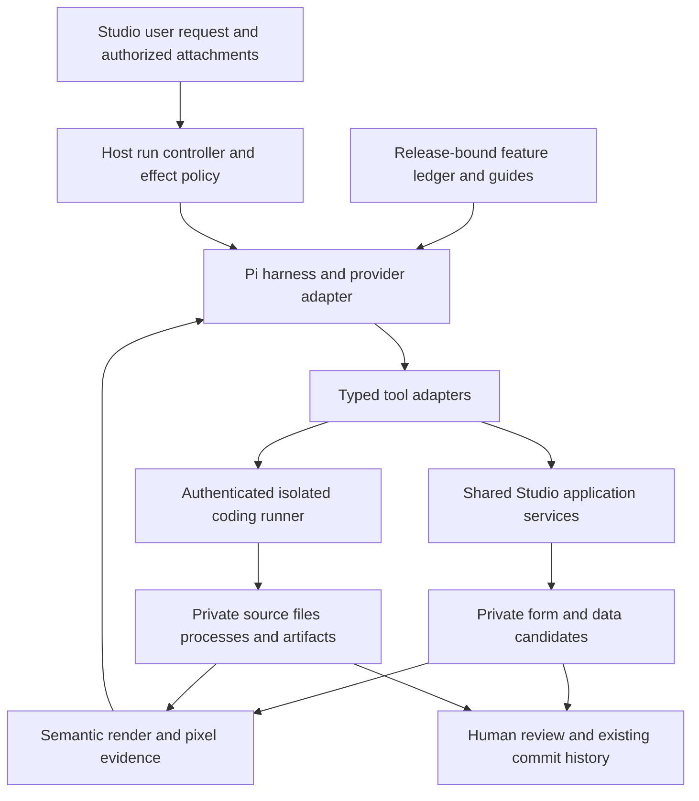

# Studio v3 Complete Coding-Agent Plan

Design for review, 2026-10-09. Inspected baseline: `main` at `b195b59ab297717168b34d007045d5e742615200` (merged PR #37). This document specifies proposed work; it does not enable source execution, approve spending or declare production readiness.

## Goal and completion meaning

Build one agent that can understand the running Printform release, inspect Studio and source projects, plan a task, use the right tools, edit, execute tests/builds, observe results, repair failures and present independently verifiable outputs. Photographs, text design requests, product questions, data binding and source debugging are task families of this same runtime.

Two distinct capabilities are required for the user's complete coding-agent target:

1. **Studio operation completeness:** every user-facing workflow is accounted for; every eligible workflow is executable through shared product services. Human file selection, native print, review and external commitments have explicit completion paths.
2. **Source coding completeness:** a real isolated project supports file listing/read/search/write/patch, shell/process execution, tests/builds, iterative repair and diff/artifact handoff. A typed form editor alone cannot close this gate.

Full capability means the declared supported profile passes both gates and real-task qualification. It does not mean unrestricted host access, every Pi CLI interaction, all providers, or permission to publish. Multi-agent work, external MCP, arbitrary extensions and automatic model retraining are optional later extensions, not prerequisites for the initial coding profile.

The built-in advantage should come from exact product state, authoritative knowledge and direct services. It is a measured target, not a consequence of embedding Pi.

## Current result and remaining gaps

| Area | Current implementation | Required extension |
| --- | --- | --- |
| Pi runtime | `pi-agent-core` and `pi-ai` pinned to 0.85.1; sequential private draft loop | Unified read/design/data/code runs, answer completion, controlled session recovery |
| Tools | Nine tools, thirteen closed authoring operation shapes, one bundled guide | Whole-product coverage, executable output/error contracts, workspace and observation tools |
| Knowledge | Release identity preflight; direct declared dependencies; explicit baseline comparison | Feature ledger, reverse impact map, last-successful-publication baseline and enforced review evidence |
| Questions | `AIPanel.useSteps` excludes read-only questions | Read-only Pi tool runs with host-enforced effect restrictions |
| Observations | Print diagnostics; initial reference images | Semantic bindings/labels, retrievable pages/crops and pixels carried on the actual provider wire |
| Source execution | No coding workspace or shell backend; core prompt prohibits scripts/shell | Separately authenticated isolated runner and approved workspace authority |
| Completion | Draft must have changes and current ready inspection; user Preview/Apply | Separate answer, form proposal, source diff and artifact results; truthful missing/failed evidence |
| Qualification | Synthetic provider and deterministic tests | Frozen real-model task corpus and supported deployment/provider qualification |

Evidence owners: [registry maintenance](STUDIO_V3_AGENT_REGISTRY.md), [loop](../studio-v3/agent-loop.js), [routing](../studio-v3/ai-panel.js), [wire](../studio-v3/agent-wire.js), [provider](../studio-v3/agent-provider.js), [package generator](../scripts/generate-studio-v3-agent.mjs), [UI actions](../studio-v3/app.js), [file services](../studio-v3/file-io.js). The [coverage inventory](STUDIO_V3_AGENT_COVERAGE_INVENTORY.md) is a pre-registry historical baseline, not a current completion score.

PR #37's 1507 unit tests and 102 final browser scenarios qualify that bounded slice. They do not qualify the proposed workspace, all Studio workflows or live-model competence.

## Architecture and ownership

Keep one Pi orchestration loop. Reuse the current registry, provider, draft protections, compiler, inspector and update protocol; add small feature modules rather than a second generic agent engine.

| Owner | Responsibility |
| --- | --- |
| Feature definitions | Stable IDs, schemas, effects, implementation/resource/evaluation dependencies and exposure reasons |
| Studio application services | New/open, design/bindings/assets, data candidates, validation, output preparation and history semantics |
| Existing CommandBus/controller | Committed project/revision/history; agent adapters cannot replace this authority |
| Host run controller | Principal, intent grants, selected scope, budgets, release freeze, cancellation and completion type |
| Coding runner | Workspace ownership, isolated files/processes, command lifecycle and artifact custody |
| Observation service | Candidate/scenario-bound semantic and pixel receipts with disclosure policy |
| Knowledge generator | Factual contract docs, guide dependencies, impact reports and immutable package identity |
| Qualification runner | Frozen inputs/budgets, independent oracles, complete attempts and immutable evidence |

The browser retains normal static Studio operation when the runner is unavailable. A coding request then reports `CODING_WORKSPACE_UNAVAILABLE`; it cannot silently claim full coding capability. Browser workers/iframes help responsiveness and rendering but are not an OS shell isolation boundary.

## Coding environment decision

Use one runner protocol and one isolated implementation first. Recommended initial profile: a user-owned local companion with per-workspace containers, loopback binding, explicit pairing and exact-origin checks. Do not expose the host filesystem, inherited environment, container engine socket or provider credentials to model-generated processes.

A hosted runner can implement the same protocol later, with tenant authentication, retention, concurrency and cost qualification. First prove deployed HTTPS Studio-to-companion transport in the supported browsers, including origin/Host validation, pairing, local-network permission, mixed-content and CORS behavior. If that profile cannot qualify, select a qualified HTTPS-hosted adapter rather than weakening browser controls. Deploying either service is a separate commitment; planning does not authorize provisioning. Neither profile changes the existing v2 frontend-only migration contract.

Support two workspace types:

- **Form project:** pinned Printform package/runtime, template source, synthetic fixtures, editable assets and tests. Builds produce a validated design/project artifact or standalone preview in isolation.
- **Developer project:** an explicitly selected repository snapshot at a fixed revision, including Printform source when authorized. Changes produce a source diff and test/build evidence; they do not replace the running Studio bundle.

File and shell tools execute only inside the owned workspace. General shell commands inside that sandbox are necessary for source coding; fixed test recipes alone do not establish general coding completeness. Pinned toolchains and dependency acquisition through an approved artifact proxy control reproducibility and egress. Unsupported dependencies return a recoverable environment error.

Start by extending the current AgentHarness with workspace tools. Evaluate the upstream coding-agent SDK only if a compatibility spike proves material reuse of sessions/tools; do not import a Node-oriented CLI bundle into the browser or replace both runtime and provider at once. [Pinned upstream coding-agent documentation](https://github.com/earendil-works/pi/blob/b2602be77cb7b0de45dd616407fd210daa48aa75/packages/coding-agent/README.md) describes file read/write/edit and bash tools plus SDK/RPC integration; [harness specification](https://github.com/earendil-works/pi/blob/b2602be77cb7b0de45dd616407fd210daa48aa75/packages/agent/docs/harness.md) describes runtime/tool registries. These are reference contracts; local 0.85.1 declarations and executable browser/runner conformance remain the integration authority.

## Product capability coverage

Reconcile the historical inventory against actual UI actions, controllers and services. Each workflow needs one stable ID and one disposition: `agent-callable`, `human-mediated`, or `intentionally-unavailable`, with a reason and human path. Whole-product coverage counts user workflows, not private JavaScript helpers. An unavailable eligible core workflow is an open completeness gap, not a way to inflate coverage.

Required families: product support; blank/starter/open/import; structure/style/page layout; collections/bindings; data inspection and explicitly requested draft edits; references/assets; scenario validation/print repair; proposal/history/recovery; editable file/standalone export preparation; source development and artifact handoff.

Move reusable UI logic into application services incrementally. UI and Pi adapters must produce equivalent normalized candidates, diagnostics and rejection behavior. Preserve unsaved form, table and JSON work on replacement. Dataset persistence, destructive replacement and external output remain distinct effects.

Read-only questions use the same Pi runtime with read/inspect/document tools, zero write grants and `finish_answer`. A code run can change its isolated source candidate but cannot obtain a live-form commit grant from prompt text. Scope/grants come from host state, not a keyword classifier or model-authored approval flag.

Detailed proposed interfaces, effects and state transitions are in [coding-agent contracts](STUDIO_V3_CODING_AGENT_CONTRACTS.md).

## Keeping knowledge current

Extend the existing package generator rather than introducing a parallel knowledge backend:

1. Derive UI dispatch IDs, tool schemas, factual docs and executable examples from feature-owned definitions. Maintain workflow guides as reviewed resources with required capability/version references.
2. Track direct and shared/transitive dependencies, source changes, guide changes and evaluation content identities. Omitted/unresolved dependencies fail checks or require a broader impact review; hashes cannot infer semantics.
3. Select the baseline manifest from the last successful publication artifact. Failed builds/deployments cannot advance it. First tracked coverage requires an explicit full inventory reconciliation.
4. Generate added/changed/deprecated/removed entries and dependent guide/example/test impacts. Require a digest-bound owner disposition: updated knowledge or justified no-impact plus relevant evidence. `reviewRequired:true` by itself is not a release gate.
5. Publish app, contracts, guides and toolchain/artifact compatibility identity together. Freeze them per run; never replace code or knowledge halfway through a candidate task.
6. On a subsequent release invalidate schema/guide caches and revalidate retained summaries. Unknown predecessors return current coverage, not an invented change history. Test old saved-form compatibility separately.

New product features require service, exposure policy, knowledge/example and conformance/task fixtures in the same change. The core prompt stays about orchestration. Reviewed lessons may later improve recipes; model suggestions cannot register trusted handlers or widen permissions.

## Delivery sequence and status ownership

[TASK.md](../TASK.md) is the authoritative implementation ledger. All CA-01..CA-10 work starts Pending; ordering below is a proposed execution sequence, not earned progress.

Tech Lead owns boundary decisions and milestone acceptance; feature owners maintain services/contracts/guides; runtime/runner owners implement execution and isolation; an independent reviewer owns qualification oracles/evidence review. One person may fill multiple implementation roles, but the model cannot be the sole judge of its own task result.

| Milestone | Tasks | Observable exit |
| --- | --- | --- |
| M0 Recorded foundation | CA-00 | Current merged slice and remaining gaps recorded |
| M1 Contracts and synchronized knowledge | CA-01, CA-02 | Complete inventory, typed contracts and reviewed release impact gates |
| M2 Shared product execution | CA-03, CA-04 | Unified effect policy, read-only answers and UI/Pi service parity |
| M3 Studio operation completeness | CA-05, CA-06 | Qualified observations and required whole-Studio workflows |
| M4 Source coding completeness | CA-07, CA-08 | Real isolated source edit/test/repair and validated artifact/diff handoff |
| M5 Qualified complete coding agent | CA-09, CA-10 | Real-task thresholds, exact artifact matrix, failure drills and rollback |

Begin the qualification harness/corpus during CA-01; close its results only after the relevant implementation exists. CA-01 closes the inventory/planned ownership map, not implemented COV-02 conformance. COV-02 closes per capability across contract and domain delivery, with full applicable closure at M3/M4. CA-07 can proceed after CA-02/03 while product services mature. Integrate CA-08 after both product and coding boundaries are proven. Every touched file remains at most 300 lines.

## Reliability, capacity and observability

Proposed initial limits, to calibrate before qualification: one mutating run per Studio document, one active command per workspace, two local workspaces maximum; 100 MiB/2000 files per workspace, 1 MiB/32 files per patch, 2 vCPU/512 MiB per container, 60 seconds per ordinary command and 300 seconds per test/build. Bound each output page to 64 KiB; large logs are truncated explicitly and separately retrievable under the same policy.

Qualification profiles freeze maximum model requests/tool calls/tokens, run deadline, image bytes, workspace/storage quotas and a monetary ceiling before execution. For a hard token/cost limit, reserve each request's priced input and bounded maximum completion before admission, or require an upstream enforced ceiling. If the provider cannot enforce/reserve it, declare the bounded overshoot and do not advertise a hard limit. Use measured form/code profiles. Missing price/usage is unavailable, never zero; dependencies and screenshots drive cost/context growth.

Proposed control SLOs on the declared reference machine: run status p95 <=500 ms; Stop acknowledgement p95 <=1 s; owned process tree terminated <=3 s; no late candidate/artifact acceptance; local control service remains responsive during a CPU-bound command. Model latency is reported separately from host/runner latency. A release packet identifies hardware, sample count and load; it does not generalize these figures to arbitrary machines.

| Failure | Required behavior |
| --- | --- |
| Provider timeout/disconnect | Preserve candidate, record unknown usage/effect, bounded retry only after reconciliation |
| Command hangs or forks children | Kill the owned process tree, invalidate late artifacts, keep health/status responsive |
| Runner disconnects/restarts | Lease expires; reconcile command/effect receipt before resuming; no implicit rerun |
| Render/visual transport fails | Report unavailable/stale evidence; never claim visual fidelity |
| Page reload/update or revision change | Preserve user work, stop/rebase only through explicit revision checks |
| Disk quota/artifact rejection | Keep last valid workspace/form candidate; report exact recoverable limit |
| Knowledge/package mismatch | Zero further model calls/effects; next coherent release or explicit recovery |

Emit redacted run/tool/command IDs, release/candidate digests, error codes, durations and known/unavailable usage. Keep payloads, source text, images and credentials out of generic logs. Separate access-controlled evidence from telemetry. Monitor task success, invalid/stale effects, command cancellation, quota/cost saturation and release mismatch. Runbooks cover provider failure, stuck process, unknown effect, package mismatch and rollback.

## Security, retention and external effects

Use authenticated workspace grants, exact-origin companion pairing, per-workspace container isolation, a read-only toolchain root and no default egress. Broker approved dependency reads; no provider key is mounted into a coding process. Reject traversal/symlink escapes, cross-workspace IDs and undeclared export destinations.

Source, imported documents, project instructions, images and test output are untrusted task material. Host policy and release contracts retain authority. Generated code may execute only in the isolated runner/preview origin, never inside trusted Studio UI or tool-handler registration.

Default runner retention is ephemeral: destroy its workspace on close or a bounded idle TTL; retain metadata-only receipts and explicitly exported artifacts under the declared policy. Resume/persisted work requires explicit host storage policy and expiry, and deletion tests cover files, logs, snapshots and caches. Customer data/provider/OS retention must be disclosed where the application cannot enforce it.

Existing authorized actions should proceed without repeated prompts. New grants or materially destructive/external commitments use host-mediated approval bound to the concrete candidate/artifact/revision. Source edits do not authorize Git push, deployment, infrastructure changes or credential use. Batch benign reversible workspace steps within an existing grant.

## Alternatives and rollout

| Alternative | Decision / trigger |
| --- | --- |
| Add more task-specific prompt branches | Reject: feature contracts and observations should determine available work |
| MCP-first replacement | Defer: built-in direct adapters are simpler; add MCP when an external client actually needs the same contracts |
| Browser-only virtual files | Useful degraded form preparation; insufficient for the required OS process/test gate |
| Import full Pi CLI/SDK immediately | Require bounded reuse spike; Node/UI assumptions cannot establish browser parity |
| Multi-service/cloud fleet immediately | Defer until measured concurrency, sharing or isolation requirements exceed the single runner profile |

Roll out behind separate unified-runtime, visual-tools and coding-runner flags. Qualify the exact app/knowledge/runner image bundle; use a small explicit pilot before changing defaults. Rollback disables the new adapter and restores its matching previous package, preserves committed projects/drafts/history, and reconciles active workspaces. Never delete user storage to make rollback pass.

The exact acceptance cases, thresholds, evidence format and completion labels are owned by [acceptance standard](STUDIO_V3_CODING_AGENT_ACCEPTANCE.md). Physical printer, Safari.app, remote runner and undisclosed provider routes require their own qualification before being advertised.

Documentation verification, 2026-10-09: eight documentation files pass local-link, whitespace, unique case/task mapping and <=300-line checks; the relocated historical task record and active v2 ledger were compared with the original and preserved. Two independent read-only reviews checked scope, gate dependencies, runner contracts and qualification consistency; identified gaps were corrected and rechecked. The acceptance standard defines 57 named deterministic cases plus the 180-attempt/profile real-task gate. No runtime or real-model execution is claimed for this documentation amendment. External KB retrieval was rejected by automatic approval because destination scope was unverified; local source and pinned public upstream references supplied the design evidence.
