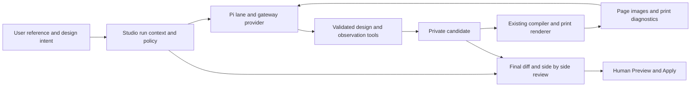

# Studio v3 Photo Design Agent Plan

Draft for review, 2026-10-09. Source baseline: `main` at `86db88c8eea242f6a83b7a4a519e6ae3b3132019`.

Scope update: the [Built In Agent Architecture Plan](STUDIO_V3_AGENT_ARCHITECTURE_PLAN.md) governs the broader product goal. Photo reconstruction is one domain workflow and acceptance case within that architecture. Its tool names and delivery sequence below are provisional until the shared capability registry is established.

The product goal is an agent that receives a form photograph, builds an editable form, observes its rendered result, corrects differences, and presents one candidate for human Apply. Studio v3 already has the Pi execution loop and substantial structural authoring. Its main gaps are visual observations, reference retrieval, creation semantics, and the layout contract. Increasing iteration limits alone cannot close them.

The recommended first delivery uses Pi with framework-native design tools and a complete visual feedback loop. This can deliver autonomous form construction without arbitrary code execution. It does not provide the full file, shell and browser environment of a general coding agent. An isolated coding workspace is a separate extension below, with a clear entry condition.

## User journey and success

1. The user attaches a fictional or redacted reference and chooses Create from reference or Amend current form.
2. The host captures the form identity, reference versions, disclosure policy and supported design capabilities.
3. The agent reads the reference and design context, identifies sections and bindings, and builds a private candidate in batches.
4. The host renders that candidate. The agent receives selected page images and deterministic print diagnostics, compares them with the reference, and repairs it.
5. The user sees the reference beside the final candidate, the changes, uncertain readings and unsupported differences.
6. Preview and Apply commit one current candidate; Undo restores the previous design. Draft work never changes source business data.

Initial acceptance covers single-table invoice, purchase order and delivery forms supported by the current framework. This is a starting assumption, not a claim that any photograph fits it. A multi-table or merged-cell reference must receive a specific capability explanation until the design schema supports it. Unreadable text remains uncertain.

The first benchmark should prioritize a clean A4 photograph, then bilingual labels, a logo, dense text and multipage output. Photograph perspective, glare and unreadable small print need separate cases and must not be silently treated as a clean scan.

## Current capabilities and gaps

| Area | Confirmed current behavior | Required change |
| --- | --- | --- |
| Execution | Real pinned Pi 0.85.1, sequential local tools, private draft, notes, cancellation and recovery from tool errors. [E1] | Retain the runtime; add the missing observations and authoring contracts. |
| Structural edits | Add, remove and reorder fields and columns; change bindings, grids, paper, typography and sections. The 24-operation cap is per tool call. [E2] | Support intentional creation and atomic reconstruction without invalid intermediate layouts. |
| New form | UI can create a blank form. Blank disables the five blocks but retains default fields and synthetic data. No agent creation tool exists. [E3] | Expose a creation intent and an explicit candidate baseline. |
| Semantics | Automatic context omits title, labels, static text and current field pointers. The catalog provides available paths/types. [E2] | Share a bounded semantic snapshot under the photo workflow disclosure. |
| Binding protection | Current `set_field` guards financial pointers, but removing and re-adding a column can change its binding while preserving source data. [E2] | Enforce frozen baseline binding rules across all candidate steps and the final net design. |
| Reference access | Local image/PDF processing produces bounded previews; source image bytes are discarded. Photos disappear after four assistant turns. [E4] | Add run-scoped retrieval; retain source raster only if detailed crops require it. |
| Visual feedback | Real print rendering exists. Inspection returns codes, geometry and numeric facts, with no pixels. [E5] | Capture the current candidate and send visual observations to the model. |
| Image transport | Tool replies are text; the custom wire drops non-text tool results. Image checks inspect user images only. [E6] | Preserve image observations, detect all outgoing pixels, and qualify the gateway wire. |
| Layout expression | Five sections, one repeating items table, equal-column section grids. Some compiled presets are absent from AI context/operations. [E7] | Expose existing presets first; extend typed layout settings only for benchmark gaps. |
| Assets | Agent can place existing raster assets. An attachment does not become a design asset. [E2, E4] | Add bounded local cropping/import from a selected reference. |
| Completion | Finish requires a ready inspection of the exact candidate. This establishes print checks, not reference resemblance. [E1, E5] | Require current visual observation evidence and report unresolved differences. |
| Quality evidence | Scripted image runs and captured redesign replays cover lifecycle behavior. They do not establish autonomous photo reconstruction. [E8] | Add a separate real-model photo benchmark with independent review. |

The gateway exposes routing aliases. Current evidence does not establish that this assistant and the embedded agent use the same underlying model, version or reasoning settings. A controlled model comparison needs those details; the confirmed tool and feedback gaps already explain an important part of the difference.

## Architecture and ownership

The current CommandBus owns committed state and history. The draft owner alone applies candidate operations. A run-scoped reference store owns attachment pages and crops. A capture adapter owns rasterization and page coverage. The provider adapter alone maps Pi observations to the gateway wire. Neither the model nor a visual score grants Apply permission.

Keep references and candidate images in memory initially; clear them on discard, document switch or run disposal. Saving the accepted form uses existing storage/export flows. Page reload ends a photo run; durable resume is a later requirement, not an implied feature of MemorySessionRepo.

## Proposed tools and contracts

All contracts below are proposals. Use closed schemas and host-created IDs. Extend existing tools where ownership already fits instead of creating parallel mutation APIs.

| Tool or operation | Input and result | Host invariant |
| --- | --- | --- |
| `get_context` extension | Design version, capabilities, approved labels/title/static text, assigned binding paths, asset metadata and current structure. | No bound dataset values, hidden keys or secret-like paths enter automatic context. |
| `view_reference` | `{referenceId,page,crop?}` returns metadata and an image; crop uses normalized bounded coordinates. | Reference belongs to this run/version; no remote URL or arbitrary file access. |
| Candidate creation | Host action selects new blank form or recreation of current design before the run. | New document creation establishes its own bus; recreation stays a private candidate of the existing bus. No mid-run identity replacement. |
| `replace_section_fields` and `replace_table_columns` | Validated typed definitions applied as one candidate step, with a complete net diff. | Reuse field/catalog/scope validation; bulk replacement cannot bypass financial binding policy. |
| Preset and layout operations | First expose existing validated `layoutPreset`; later add corpus-required tokens. | Every property is supported by validation, compiler, inspector and export together. |
| `crop_reference_asset` | `{referenceId,page,rect,role}` returns a local asset ID and dimensions. | Only selected decoded raster, bounded output, local asset ownership and exact Undo cleanup. |
| `view_draft` | `{pages}` returns diagnostics metadata and images for the current candidate. | Capture identity, policy and page coverage match this candidate; old results cannot qualify finish. |
| `finish` extension | Summary, visual evidence IDs, reference coverage and unresolved differences. | Current deterministic inspection and current visual review are required; output remains a proposal for human review. |

A recreation baseline should keep the dataset/schema and a host-owned map of required business bindings, frozen before the run. Check this map for every existing `apply_operations` step, bulk replacement, recreation and final proposal; reusing only the current operation validator is insufficient. Missing reference values do not become invented sample data. Available bindings map real fields; unsupported or unknown bindings are identified as unbound placeholders where the design schema permits them. Required financial fields cannot be replaced with static numbers or removed and re-added to evade the policy.

Creation must retain accurate Before/After history and respect the existing net-diff limits. A large bulk step is not permission to accept opaque replacement JSON. If the current diff contract cannot describe the candidate, extend structural diff representation with tests before enabling that case.

The agent records a compact design brief in notes: reference regions, section/column order, planned bindings, uncertain text and remaining differences. Bundled form-design instructions may later be exposed by a small `read_skill` tool. A general skill registry is not a prerequisite for the first photo loop.

## Visual capture and gateway qualification

There is no qualified v3 raster capture adapter yet. Phase 1 must establish one before image-based matching is advertised. Capture occurs in a dedicated candidate preview with the same compiler/runtime, after fonts, images and rendering settle. The adapter returns per-page images at known print dimensions, plus crop coordinates and diagnostics.

The v2 capture implementation manually paints DOM text, backgrounds and some borders on canvas. Its synthetic-only policy, evidence identity and cancellation patterns are reusable; its painter is an approximation and must not be labeled an actual browser screenshot. [E9]

First spike a browser-local raster adapter and compare it against actual Playwright page screenshots on supported engines. Check fonts, wrapping, borders, grids, logos and long tables. Do not weaken the iframe sandbox or enable network access for capture. If capture cannot meet the fidelity gate, use an isolated browser-render service for approved synthetic candidates, or narrow browser support explicitly. A service adds deployment and data-transfer requirements; GitHub Pages alone cannot host that execution.

Pi's installed tool-result types already support text and image blocks. Its installed Responses mapper can produce multimodal function outputs, while the project's custom mapper currently keeps only text. This is an adapter gap, not a requirement to replace Pi. The actual Demo gateway must still qualify that output shape; standard provider support is not proof that this gateway accepts it.

Keep the function call/result pairing intact. Prefer a qualified multimodal `function_call_output`. If the gateway only supports user-role images, use a host-created observation message linked to the tool receipt after the textual result, and qualify that alternative. Neither shape may interpret reference text as system instructions.

Image capability and streaming policy must derive from the final serialized request, including tool observations. Synchronize the provider's image input metadata only after verified discovery. Recheck before dispatch, including session refresh. Fold or expire old images while retaining their bounded receipts; the current string-length compaction must not repeatedly serialize an unbounded raster history.

Configured gateway ceilings are four images, 8 MiB aggregate image payload and 12 MiB total body; reference previews are up to 1280 px longest edge and 1 MP. Existing reference checks measure data-URL/serialized lengths, not eight MiB of decoded raster bytes. The agent path currently checks body size but lacks a unified final-wire image guard. [E4, E6] Add count, individual URL/decoded-size, aggregate serialized-payload and total-body checks before dispatch. Four attached reference images leave no room for an additional candidate image. Schedule selected reference pages and candidate pages across requests within those ceilings. Requesting a crop of a downscaled preview does not recover discarded detail; retain a separately bounded decoded source only after that need is demonstrated.

## Evidence and completion

Each observation receipt contains `runId`, document/base revision, candidate design digest, render-input digest, reference version/digest, disclosure policy version, page/crop list, render dimensions and image digests. The host creates receipts and checks them before outbound dispatch and finalization. Any candidate edit invalidates the prior candidate review.

Record which successful provider request included each observation. A qualifying comparison must come from a later model response to a request containing the current reference/candidate images. Calling capture and finish in the same assistant batch cannot pass: the model has not seen that tool result yet. Local capture alone never establishes review.

Keep technical print readiness separate from visual comparison. The model can describe differences and uncertainty, but a self-reported similarity number is not a release gate. Finish should establish that the current candidate was observed and compared, then show any unresolved differences. The product wording is Ready for review, not Exact reproduction.

The final comparison covers the reference's intended page regions and all candidate pages. Long-table benchmarks may inspect selected detailed crops plus overviews, but may not declare unseen pages reviewed. Empty output, stale evidence, incomplete required coverage or missing inspection produces a recoverable named error.

## Privacy and execution boundaries

The current Demo workflow permits fictional references and sends selected pixels to the gateway/provider. Generated page images introduce a new disclosure surface: they can reveal business values that numeric diagnostics currently hide. Initial photo mode must render deterministic synthetic display data and only approved labels/static text for model observations. Original data and bindings remain unchanged for local human preview and Apply.

Synthetic observations are labeled as such and bound to their own render-input digest. Their text wrapping may differ from real data. Run the final deterministic print inspection locally with the actual candidate data; a passing synthetic screenshot cannot replace that check or prove the actual populated form was visually reviewed.

Candidate asset pixels need their own allowlist. Only approved fictional reference crops or approved embedded assets enter model observations; replace other existing images with declared placeholders. Synthetic bound values do not sanitize a signature, logo or scanned document already embedded in the design. Asset IDs and dimensions are metadata, not permission to transmit their pixels.

Update the recipient notice before Send to describe selected references, approved design text and synthetic candidate snapshots. Freeze that policy with the run. A crop tool or photograph never expands edit scope, data access, provider destination or execution authority. Real populated snapshots need a separately defined product policy; do not inherit permission from a fictional upload or v2 Synthetic policy.

Reference text, OCR-like model readings, comments and tool outputs remain untrusted content. Embedded instructions cannot select tools, create remote resources or execute code. Keep image bytes, business text and credentials out of debug logs, reusable memory and public benchmark artifacts.

## Delivery sequence

| Phase | Concrete work | Exit evidence |
| --- | --- | --- |
| 0 Define the benchmark | Three representative clean single-table references; expected content/layout rubric; one unsupported and one unreadable case. Map every required feature to the current compiler. | Supported target is explicit; gaps are reproducible rather than inferred from arbitrary photos. |
| 1 Prove the visual path | Reference retrieval, capture spike, tool-image mapper, request-wide pixel detection, receipts and disposal. Align the prompt/context with the new observation contract. | A model receives the reference again after turn four and sees its freshly rendered candidate; capture fidelity passes. Gateway compatibility is recorded. |
| 2 Enable construction | Explicit creation intent, semantic context, atomic field/column reconstruction, existing preset exposure and local reference-asset import. | Agent builds a form from a blank candidate with correct structure/bindings or explicit unresolved mappings. Apply/Undo/save/export preserve data. |
| 3 Close visual iteration | Compare current candidate against reference, repair identified differences, invalidate old evidence and present side-by-side review. | Deliberately wrong title position, spacing or table width is repaired or specifically reported; fresh inspection and page coverage gate finish. |
| 4 Expand measured gaps | Add only layout tokens required by the corpus; version design schema if needed for new sections/tables. | Inspector, AI, compiler, import/export and printing agree; old saved forms still open. |

Phases 1 and 2 together are the first useful vertical slice; Phase 1 alone is transport/capture qualification. Start with one successful complete reference before expanding to broad photograph support. Do not postpone truthful unsupported results until every layout feature exists.

Candidate code ownership: `agent-tools.js` for tools, `agent-draft.js` for mutation/history, `ai-authoring*.js` for contracts/context, `agent-wire.js` and `ai-demo-transport.js` for wire/capability checks. Add separate reference-store, capture-adapter and observation-receipt modules rather than growing `ai-panel.js` beyond 300 lines. Extract preview bridge code before extending the renderer substantially.

## Verification and release gates

### Deterministic correctness

- Image tool results reach the wire with correct call IDs; actual image presence triggers capability, non-streaming and total-body checks.
- Unknown reference IDs, stale versions, invalid crops and unauthorized policy transitions fail without provider dispatch.
- Candidate changes invalidate captures/reviews; duplicate read/capture calls cannot mutate committed state.
- Bulk reconstruction and existing multi-step remove/add paths preserve frozen required binding rules, source data, selection scope and complete Before/After diffs.
- Synthetic captures exclude unapproved labels/static text and existing sensitive raster assets; placeholders do not imply visual review of the omitted content.
- Stop and context changes cancel capture/provider work; late images cannot revive or finish an abandoned run.
- Apply remains one guarded history entry; Undo, save/open and standalone export reproduce the accepted design.
- One-row, long-text and multipage cases retain row order, readable currency, correct repeat headers and no overflow.

### Capture fidelity

Use identical synthetic fixtures for capture output and actual browser screenshots. Require exact page dimensions/count and correct content/asset presence. Compare typography, wrapping, geometry, colors and borders with a tolerance calibrated on supported engines. Set the numerical tolerance from this spike before rollout; do not invent a percentage as proof. Browser-local approximations must expose their capture method in evidence.

### Real model behavior

Use a frozen fictional corpus with expected headings, section/column order, required field mappings, logo placement, major alignment and spacing. Independent human review checks fidelity; deterministic checks protect data and printing. Record per-case results and repeat the three core cases three times for a nine-run pilot. A clean pipeline run alone does not demonstrate reliable model performance.

Proposed pilot target: at least eight of nine core runs accepted by the predeclared rubric, zero critical data/scope/Apply failures, and correct uncertain/unsupported outcomes on every negative case. These are release criteria to validate, not measured results. Include a longer-than-four-turn case and a deliberate visual defect to prove retrieval and correction.

Record the gateway alias, available underlying route/model/version, image capability, prompt/contract version, reference/candidate digests, bounded tool trace, request count, actual/unavailable usage, duration and review outcome. Keep payloads local and synthetic. Do not attribute quality differences to Pi or model intelligence when route identity is unknown.

The existing 60-minute, 1000-tool and 2M-token limits are ceilings, not measured photo targets. Proposed initial photo configuration is 10 minutes, 30 model requests, 100 tool calls, six visual repair passes and 100k accounted tokens; keep current per-request and image limits. Missing usage stops execution. One admitted response can cross the token cap. Calibrate latency and cost on the pilot before treating these numbers as production SLOs or strict billing limits.

## Failure handling and rollout

| Failure | Required outcome |
| --- | --- |
| Vision/tool-image route unavailable | Explain unavailable photo mode; preserve the candidate. Do not silently substitute a text-only match claim. |
| Capture inaccurate or unsupported | Block visual completion or identify the supported capture/browser alternative. |
| Photo unreadable or distorted | Mark affected readings uncertain; request a clearer reference only where construction depends on it. |
| Unsupported layout | Report the exact missing primitive; show a supported approximation only as an approximation. |
| Changed dataset/document/reference | Abort and require a new run for the current context; no stale Apply. |
| Budget, timeout, provider or disposal failure | Stop further dispatch, retain a reviewable local status and leave committed form unchanged. |

Introduce photo mode behind a feature flag while preserving current edit mode. Local contract/capture checks precede an opt-in synthetic gateway pilot. Expand only after quality and lifecycle gates pass. Rollback disables photo mode and leaves saved forms/history usable; a schema extension needs explicit backward compatibility and migration tests.

Track completion and block reasons, review acceptance by fixture family, capture failures, requests/tokens/duration, and repeated no-improvement loops. Alerts or pilot stop conditions should cover a data/scope leak, repeated capture failure and unexpected usage. Metrics do not store reference or business payloads.

## Full coding workspace alternative

If the requirement is literally a coding agent that edits files, runs commands and tests custom rendering code, the browser tool loop is not that product. Add an isolated backend workspace with file read/write, bounded command execution, build/test, browser preview and screenshot tools; keep output import and human Apply in Studio. This requires server execution, authenticated ownership, resource/egress limits, artifact validation and cleanup, beyond the current static host.

The trigger is a supported benchmark whose layout needs custom components or renderer code that typed design extensions cannot reasonably express, or an explicit requirement for code authoring itself. Treat this as a deliberate architecture phase. A coding workspace still needs the same visual observations and reference retrieval; shell access alone does not create photo fidelity.

For common business forms, framework-native tools are the lower-maintenance first delivery. They keep results editable in the inspector and compatible with existing printing. Raw code increases freedom but also requires validation that code, semantic structure, bindings and exported output remain consistent. Neither path can promise arbitrary pixel-perfect reconstruction from an unreadable photograph.

## Evidence and verification status

The investigation ran five existing local suites: authoring and AI authoring, agent wire, reference sharing, and preview handshake. **Five files / 65 tests passed.** A synthetic serialization probe confirmed that current tool-result images are dropped. A separate two-step draft probe removed and re-added `items-rate`, changing its binding from `./rate` to `./quantity` with source data unchanged; the proposed baseline-map guard must cover that path. No product code was changed, no live model was called, and no user photo was evaluated for this plan. Proposed release targets remain unmeasured.

The routed investigation, architecture and verification module files are absent from this repository. The project core instructions and current source/tests governed this investigation. Retrieved memory contains the earlier Studio three-pane UI preference, not a prior approved photo-agent architecture.

- **E1**: [Agent loop](../studio-v3/agent-loop.js), [tools](../studio-v3/agent-tools.js), [draft](../studio-v3/agent-draft.js), [pinned dependencies](../package.json). Pi owns conversation execution; application tools supply form capabilities. [Upstream harness specification](https://github.com/earendil-works/pi/blob/b2602be77cb7b0de45dd616407fd210daa48aa75/packages/agent/docs/harness.md).
- **E2**: [Authoring operations and context](../studio-v3/ai-authoring.js), [contract](../studio-v3/ai-authoring-contract.js), [prompt and scope](../studio-v3/ai-chat-protocol.js), [authoring tests](../tests/studio-v3-ai-authoring.test.js).
- **E3**: [Project and blank defaults](../studio-v3/model.js), [new form action](../studio-v3/app.js).
- **E4**: [Reference processing](../studio-v3/reference-files.js), [image decoding](../studio-v3/reference-images.js), [limits](../studio-v3/reference-limits.js), [sharing](../studio-v3/reference-sharing.js), [reference UI disclosure](../studio-v3/ai-reference-files.js).
- **E5**: [Paper preview](../studio-v3/preview.js), [sanitized inspection](../studio-v3/ai-inspection.js), [panel inspection and Apply](../studio-v3/ai-panel.js).
- **E6**: [Agent wire](../studio-v3/agent-wire.js), [gateway transport](../studio-v3/ai-demo-transport.js), [dispatch limits](../studio-v3/ai-gateway-config.js), [provider metadata](../studio-v3/agent-provider.js).
- **E7**: [Design primitives](../studio-v3/design-authoring.js), [validation](../studio-v3/design-validation.js), [compiler](../studio-v3/template.js), [preset styling](../studio-v3/a4-theme.js).
- **E8**: [Scripted image loop](../e2e/studio-v3-agent-steps.spec.js), [captured redesign replay](../e2e/studio-v3-captured-redesign-export.spec.js), [live text redesign path](../e2e/studio-v3-live-redesign.js).
- **E9**: [v2 canvas approximation](../studio-v2/ui/preview.js), [v2 layout evidence identity](../studio-v2/core/layout-review.js), [v2 layout review loop](../studio-v2/ui/agent-layout-loop.js). Reuse requires explicit adaptation to v3.
